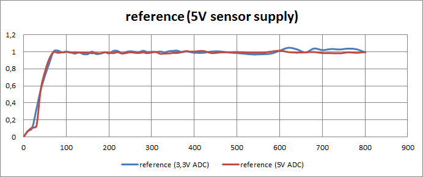

# GP2D120, GP2Y0A21 and GP2Y0A41 transfer functions
Study of the transfer functions of the sensors GP2D120, GP2Y0A21 and GP2Y0A41.

Normally, the analog distance sensors are non-linear systems that provides a rare transfer function voltage/distance. So, I've tried to create a formule of each case to convert automatically the voltage to the distance.

If you observe the next image, you can see the problem. The non-linear function avoids to determine the distance directly with a simple linear function and we would have to create a table with the values for converting them. Also, the first region can may led to confusion because in this case two distance values exist for the same voltage value. So, we have to avoid the first region, and the manufacturers says they aren't able to measure distances less than a minimum value, like 10 cm in the case of GP2Y0A21.

Taking the values of the ADC of a microcontroller, we obtain values that are proporcionally to the voltage. Now, converting this values with the formule I use in the "in code" colums in each case, we can get the distance value.

And now, looking at the next image, we can see how accurate is the algorithm. If the reference function is close to 1, that's well to get the measure. But note that using a low-reflectance surfaces, like black surfaces, or different supply voltages can provide us a different output. I have done this experiment using a white surface, with the normal vector parallel to the sensor beam.

Supposing a measured ADC value between 0 and 1023 (10 bits ADC), the approximate transfer functions are:
* GP2D120 (5V sensor supply & 3,3V ADC): distance = 16,8 * ((2914 / (adc_value + 35) - 0,5))
* GP2Y0A21 (5V sensor supply & 3,3V ADC): distance = 31 * ((3000 / (adc_value + 1) - 0,8))
* GP2Y0A21 (5V sensor supply & 5V ADC): distance = 17,5*((3000 / (adc_value - 15) - 1))
* GP2Y0A41 (5V sensor supply & 5V ADC): distance = 10,1 * ((2914 / (adc_value + 18) - 1,5))

## Author
[Rubén Espino San José](https://github.com/Resaj)

## License

Todos estos productos están liberados mediante [Creative Commons Attribution-ShareAlike 4.0 International License](http://creativecommons.org/licenses/by-sa/4.0/).  
_All these products are released under [Creative Commons Attribution-ShareAlike 4.0 International License](http://creativecommons.org/licenses/by-sa/4.0/)._
